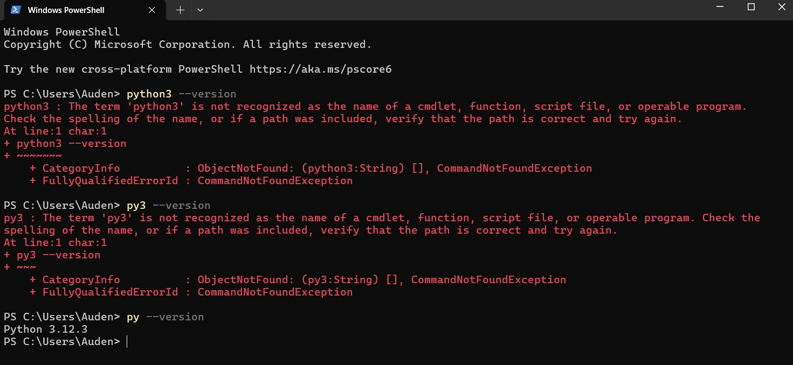
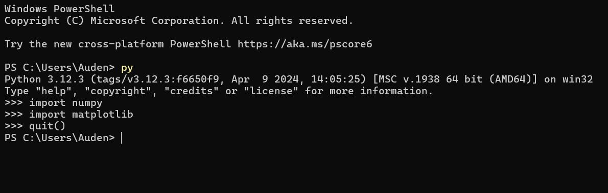
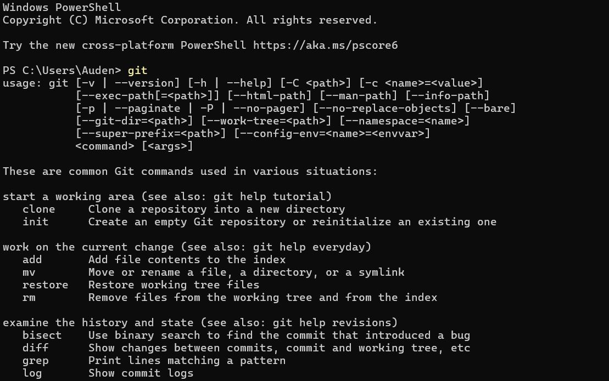
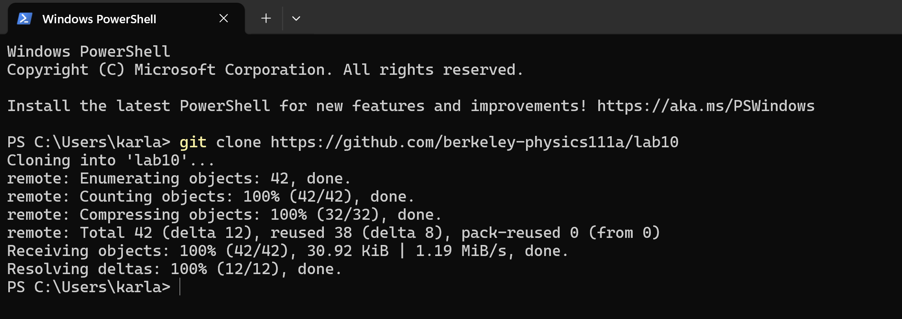
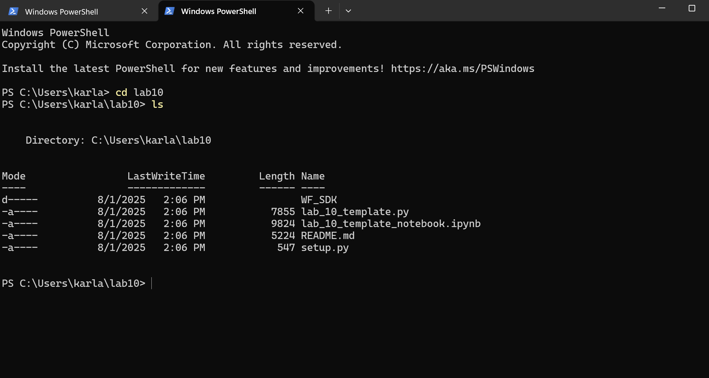
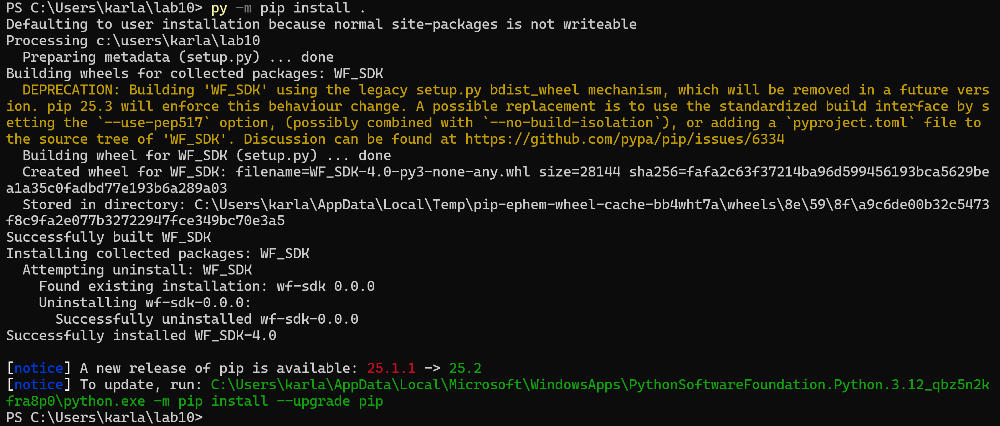
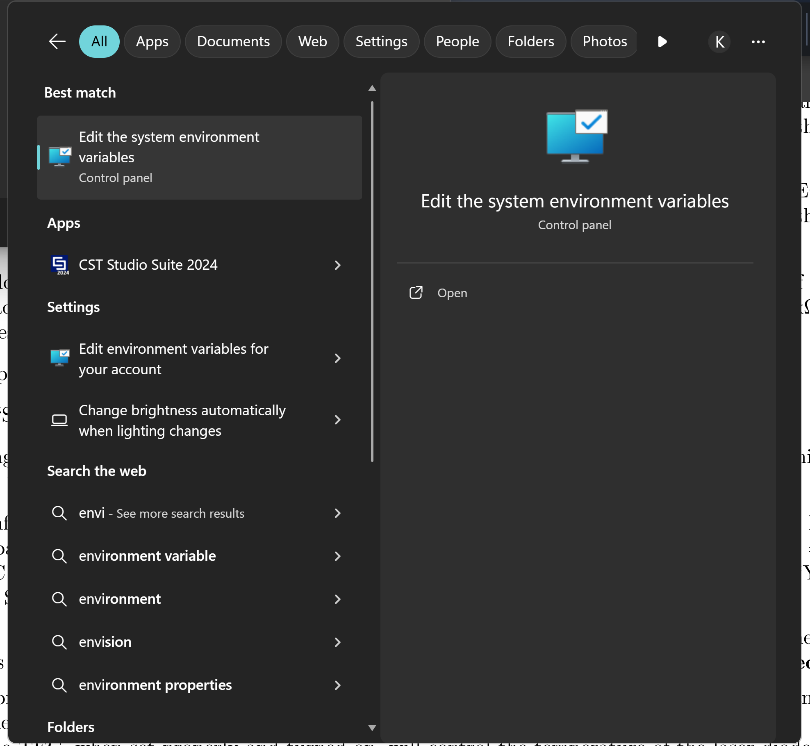

## Lab 10 Installation Instructions

### Prerequisite software

First, check through that everything from A.1-A.3 in Appendix A has been installed correctly. 

#### Python and dependencies

Open a terminal (or PowerShell, if on Windows) and run the command

```python3 --version```

You should get a version >= 3.11. If the first command doesn't work, try ```py3 --version``` and ```py --version```. Whichever of these commands works tells you what you should replace ```python3``` with in the commands that follow (i.e., if ```py3 --version``` gives you an acceptable version, you should be running ```py3 -m pip install [whatever]``` in the commands below instead of ```python3 -m pip install [whatever]```). If none of these work, there is something wrong with your Python install. See the 'Debugging Tips' section below.



If you did get a version >= 3.11, run ```python3``` (or ```py3``` or ```py``` as appropriate) in your terminal (or PowerShell, if on Windows). This will open an interactive Python session. Run the following:

```import numpy```

```import matplotlib```



These should just run successfully without producing any output. If there's an error, you need to install these packages. Use ```quit()``` to exit the interactive Python session and return to the main terminal (or PowerShell, if on Windows). Then run the following:

```python3 -m pip install --upgrade pip```

```python3 -m pip install numpy matplotlib```

The first upgrades pip, and the second installs two standard packages we will need. Run ```python3``` again to open the interactive Python session, and try the import statements again to make sure they worked. If they did not even after you have run ```pip install```, see the 'Debugging Tips' section below.

#### Git

It is optional but highly recommended to install git. Git is version control software, much like the document history in a word processor like Google Docs, but designed for management of large codebases. You will likely use it in the future whether in graduate school or in industry. If you do not want to install it, proceed to the next section.

Install git following the instructions here: https://github.com/git-guides/install-git

Then, open your terminal (or PowerShell, if on Windows) again and run ```git```. If it does not error and gives you a help message, it was successfully installed; if it errors even after following the steps above, see the 'Debugging Tips' section.



### Downloading the repository


#### With git

If you installed git, open the terminal (or PowerShell, if on Windows) and navigate to the directory you want the folder to be in. To do this, you can use the following commands:

```cd [name]``` will navigate inside the ```[name]``` folder/directory (replace ```[name]``` as appropriate).
```ls``` will list all of the files/folders within your current directory. (See below for image demonstrating their use.)

You can use tab to autocomplete folder/file names. Once inside the folder you want to save your code in, run the command

```git clone https://github.com/berkeley-physics111a/lab10```



If you run ```ls``` again, you should now see a folder called ```lab10``` containing all the files from the repository.

#### Without git

If you did not install git, you may alternatively download the files individually. Make sure you are at https://github.com/berkeley-physics111a/lab10 (which you are presumably already at if you are reading this), go to the green "Code" drop-down menu, and select "Download ZIP". Then unzip the folder.

 for installing without git")

### Installing the last dependency

You should already have NumPy and Matplotlib installed; see the 'Prerequisite Software' section. We're now going to install the package which controls the ADS.

#### With git

In a Terminal window (or PowerShell, if on Windows), run the following command to install the software which controlls the ADS:

```python3 -m pip install git+https://github.com/Digilent/WaveForms-SDK-Getting-Started-PY#egg=WF_SDK```

Next, run ```python3``` in your terminal (or PowerShell, if on Windows) to open an interactive Python session. Run

```import WF_SDK```

If it runs without producing any output/erroring, it has installed successfully; run ```quit()``` to close the session - you are ready to begin the lab. If it errors, see the 'Debugging Tips' section.

#### Without git

In a Terminal window (or PowerShell, if on Windows), navigate inside the ```lab10``` folder you installed in the previous step. To do this, you can use the following commands:

```cd [name]``` will navigate inside the ```[name]``` folder/directory (replace ```[name]``` as appropriate).
```ls``` will list all of the files/folders within your current directory.



You can use tab to autocomplete folder/file names. Once inside the ```lab10``` folder, run the command

```python3 -m pip install .```



If it runs without erroring, run ```python3``` in your terminal (or PowerShell, if on Windows) to open an interactive Python session. Run

```import WF_SDK```

If it runs without producing any output/erroring, it has installed successfully; run ```quit()``` to close the session - you are ready to begin the lab. If it errors, or if the ```pip install .``` command errored, see the 'Debugging Tips' section.


## Debugging Tips

### I installed Python/the package/git, but then it won't actually run!

#### Check it is on the PATH

If you have installed Python but none of ```py --version```, ```py3 --version```, and ```python3 --version``` produce the correct output in the terminal, a good first step is to check and see if your PATH variable is correct. Your computer system has what are called environment variables, and one of them, called PATH, helps the system know where to look for files/software (this is a very rough explanation). If things aren't properly added to the PATH, your system may not be able to find them.

Go to your application search bar and search 'environment variables'; you should see something like 'edit environment variables' or 'edit system environment variables'; click to open this.



Then, you should see a button saying something like "environment variables"; click this. You should then see a list of variables. Click to highlight the one called "PATH" and hit the edit button. Then, you should see a list of file paths that are in the variable. You should see one for Python and (if you installed git) git. 


If you do not, you need to add them. Open your file explorer and find where your Python (and git, if relevant) installs are located. You can use the search bar, or start by going to the 'Local disk' folder. (They tend to be installed in similar folders to the ones in the path in the image above. You may need to go to the 'View' tab in your file explorer and select any checkbox/option to 'show hidden folders' in order to see some of the relevant directories.) Once you find it, highlight the folder, right click and select 'copy path', and then go back to your environment variables window, hit 'New', and paste in your new path. Make sure you add it to your PATH variable, not a different one, and that you do not delete any of the other paths in the variable. Then hit okay, close your terminal, reopen the terminal, and try again.

Adding to PATH is generally annoying, but fixes the vast majority of problems that I have seen with installs.

#### Running the right version?

Make sure you are running the pip installs using ```python3 -m pip install``` instead of just ```pip install```; otherwise this sometimes installs the package for a different version of python which can lead to it not importing properly. If you have multiple versions of python installed, you may need to run  ```python3 -3.11 -m pip install [package]``` (or -3.12, or -3.13, whatever is applicable to your system) - this specifies the version number to install to.

### Package install issues

The error message will often tell you what's wrong, and if you're unsure, you can google it - Stack Overflow often will have helpful answers for what is causing a particular error message. If you have repeated issues or are really stuck, ask a GSI or tutor, but it's good practice to learn how to read error messages.